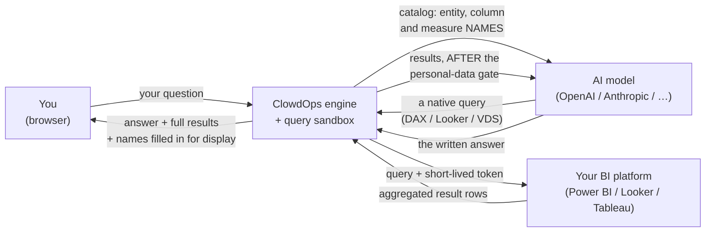

[← ClowdBI](README.md) · [← Cross-dataset links](cross-dataset-links.md) · [Asking good questions →](asking-good-questions.md)

# Data privacy & personal data

**On this page:** [The data flow](#the-data-flow) · [What the AI model receives](#what-the-ai-model-receives) · [What it never receives](#what-it-never-receives) · [Where your credentials live](#where-your-credentials-live) · [The personal-data boundary](#the-personal-data-boundary) · [Working with sensitive entities](#working-with-sensitive-entities) · [When you type personal data yourself](#when-you-type-personal-data-yourself) · [Names on dashboards](#names-on-dashboards) · [Leaving your organisation](#leaving-your-organisation) · [The audit trail](#the-audit-trail) · [Known limits](#known-limits)

This page is the complete account of what ClowdBI sends where. If you are evaluating ClowdBI for data covered by GDPR, HIPAA, or an internal data-handling policy, this is the page to read — including [Known limits](#known-limits), which documents what the boundary does *not* catch.

## The data flow

Three parties are involved in answering a question, and they see different things.

The shape to take away: **the AI model is in the loop for authoring and explaining, and out of the loop for access.** It never holds a credential and never contacts your BI platform. Everything that touches your data runs in the engine and its sandbox.

Where execution happens:

- **Ad-hoc queries** run inside an isolated `sandbox-bi` container — a minimal image, unprivileged user, no shell access for the agent, holding only a minutes-valid access token.
- **Dashboard refreshes** run in-process in the engine with no AI model involved at all. Reloading a board costs nothing and sends nothing anywhere.

## What the AI model receives

Be precise about this, because "the LLM only gets metadata" is a common shorthand that is not quite true.

| Sent to the model | Contains |
| --- | --- |
| **The catalog summary** — injected at the start of every conversation | Entity names, measure names and descriptions, relationships. Names only. |
| **Column detail** when the agent inspects a table | Column names, data types, a rough sense of how many distinct values a column holds, whether it is personal data, and any description. No values. |
| **Your question**, verbatim | Whatever you typed |
| **Aggregated query results** | The real answer rows — business figures and non-personal grouping keys |
| **Dashboard previews** while authoring a board | Up to 20 rows per panel |

That fourth row is the one shorthand tends to omit. The model **does** read your numbers — it has to, in order to explain them, notice a trend, or catch that a figure looks wrong. What it reads is an aggregate: `Region | Revenue`, not a customer list.

> [!NOTE]
> **Query results are not replayed on later turns.** Within a turn, the model reads the result grid. Across turns, only the written prose is carried forward — the underlying grids are not re-sent. A number the agent quoted in its answer persists in the conversation; the table it came from does not.

## What it never receives

- **Credentials of any kind** — refresh tokens, client secrets, personal access tokens, and even the short-lived access token.
- **Raw personal-data values** — enforced by the gate described [below](#the-personal-data-boundary).
- **Names shown on dashboards** — a person's name displayed beside a reference code is fetched at the last moment, purely for your screen, and removed before the model sees the rows.
- **The values used to match two datasets** — when the agent checks whether two datasets describe the same things, it compares their key columns in memory only. Those values are never sent to the model and never saved.
- **Lists of individual records** — the agent must write queries that summarise. Both the platform's own limits and the rules the agent works under rule out pulling raw detail rows.

## Where your credentials live

Your BI connection secrets are encrypted at rest (AES-256-GCM, with the key itself wrapped) and stored alongside only non-secret routing information — a tenant id, a base URL, an expiry.

- **They are unlocked in one place only**, at the moment a call to your BI platform has to be made. They travel encrypted everywhere else, including through the parts of ClowdOps that store and route them.
- **Only a short-lived pass — valid for minutes — reaches the sandbox.** The long-lived credential that mints it never leaves the engine.
- **No secret ever appears in the record of what ran**, so nothing sensitive can surface in a log or a transcript.
- Tokens are refreshed lazily and rotated back into storage automatically, so a long-lived connection keeps working without you re-authenticating.

## The personal-data boundary

Every column in your catalog is classified when the model is discovered — by column *name and metadata*, never by reading values. Classes include `name`, `email`, `phone`, `address`, `national_id`, `dob`, `financial`, and `none`.

Those classes fall into three groups:

| Group | Which columns | Can the agent group results by it? |
| --- | --- | --- |
| **Not personal** | Everything else | Yes, freely |
| **Business identifiers** | Tax ids, company registration numbers | Yes — but every use is recorded in your activity log |
| **Personal details** | Names, email addresses, phone numbers, postal addresses, dates of birth, financial details — and anything the system does not recognise | **No.** Never used to group results, and never included in anything the model reads |

Two things about how this behaves matter more than the list itself:

**Anything unrecognised counts as personal.** A column only passes if it is positively recognised as ordinary business data or as a business identifier. Anything else — including a column the system could not make sense of — is treated as personal and withheld. It errs toward caution rather than assuming a column is harmless.

**If the check itself cannot run, nothing gets through.** When the personal-data information is unavailable for some reason, the result is held back and the agent retries. It never falls back to "probably fine".

### Where the checks happen

There are two, and both are built into the system rather than being instructions the model is asked to follow:

1. **Before a dashboard is built** — a board that would use a personal-details column as a category, a label, or a filter is refused before it is created.
2. **After a query runs, but before the model sees the results** — the results are checked against what your catalog says about each column, plus a second sweep that looks for anything shaped like an email address, no matter what the column was called.

### What you actually see when it fires

Usually: nothing unusual. The agent is told *"group by a non-personal id and report aggregates"*, it repairs the query, and you get a correct id-grouped answer a second later. From your seat, a question phrased around personal data quietly self-corrects.

If it cannot repair the query (it gets two attempts), the agent tells you plainly that it could not answer without exposing personal data, and suggests what to group by instead.

## Working with sensitive entities

**Recommendation: give the agent an anonymised identifier for anything sensitive.**

If your models contain customers, patients, employees, or accounts, add — or expose — a stable non-personal reference column, and let that be the entity's identity as far as ClowdBI is concerned.

| Instead of grouping by | Group by |
| --- | --- |
| `Customer[Email]` | `Customer[CustomerRef]` — `C-84021` |
| `Patient[FullName]` | `Patient[PatientCode]` — `PT-7741` |
| `Employee[NationalID]` | `Employee[StaffNumber]` — `E-2210` |

This is worth doing even though the boundary already enforces it, for three reasons:

- **Better answers.** The agent stops hitting a wall and repairing; it queries correctly the first time.
- **Less personal data in flight, full stop.** An anonymised id is not personal data to begin with, so no gate has to catch anything.
- **Charts you can share.** A board grouped by reference codes can be snapshotted and sent to someone outside the team without a redaction pass.

> [!TIP]
> If your BI model has no such column, adding one is usually a small change — most systems already hold an internal reference number for each record, and exposing it as a column is often enough. It pays for itself the first time someone asks for a per-customer breakdown.

> [!IMPORTANT]
> **This reduces exposure; it does not put the data out of scope.** A reference code still points back to a real person, because you hold the list that connects the two. Under GDPR that means it is still personal data and your obligations still apply. What changes is where the identity travels: the name and email stop being sent to an outside AI provider. Treat it as limiting how far personal data spreads, not as anonymising it.

## When you type personal data yourself

The boundary governs what comes *out of your data*. It does not censor what you type.

If you write *"how much did Sarah Whitfield spend last quarter?"* or paste an email address into the composer, **that text is sent to the AI model as written**. ClowdBI detects the common cases — email addresses, national id numbers, bank account numbers, and person names — and shows an amber banner in the conversation:

> **Privacy notice:** You referenced *email address* directly; that text is sent to the AI model as written.

<!-- Screenshot:  -->

Two consequences to be aware of:

- The turn **proceeds**. Nothing is scrubbed or blocked — the banner informs, it does not intervene.
- For that turn, the output gate is **waived**. Having named the person yourself, results about them are no longer withheld from the model. This is deliberate, and it is why the banner exists.

The audit record notes *that* personal data was referenced and of what class. It never records the value.

## Names on dashboards

Dashboards routinely need to show human names, and they can — without those names reaching the AI model.

The panel groups by a non-personal id. The name column is nominated as a *display label*. At render time the engine fetches the label, attaches it to the row, and sends it to your browser. The version handed to the model has the label stripped.

So a board reading **"Top 10 sales reps"** with real names on the axis is doing exactly what you would want: names on your screen, ids in the model's context.

## Leaving your organisation

A **live dashboard** is visible only to members of its data project, and it needs a working credential plus the engine to render at all. It is not meaningfully shareable outside your organisation.

A **snapshot** is different — it freezes the data. That is the point at which numbers stop being protected by your BI platform's own permissions and start standing on their own, so taking one is a deliberate, recorded action, and each snapshot carries its own access list:

- A **named grant** to a specific user.
- An **anonymous link** (`/s/…`) that anyone with the URL can open without logging in. Links expire, can be revoked, and only a hash of the token is stored.

> [!IMPORTANT]
> External sharing is **off by default** for an organisation. An administrator must enable it before anonymous or cross-organisation links can be created. Until then, attempting to share returns *"External sharing is off for this organization."*

**Exports** (CSV, Excel, PowerPoint, PDF, PNG) contain real values, names included — deliberately, since the file is for you. Every export is therefore recorded: what was exported, by whom, and what kinds of personal data it contained. Never the values themselves.

## The audit trail

ClowdBI records governance events to your organisation's [Activity log](../common/settings.md#activity):

| Event | Recorded when |
| --- | --- |
| A business identifier was used to group results | The agent groups by something like a tax id or company registration number |
| Personal data was mentioned in a question | You type a name, email, or id number into the composer — **the kind only, never what you typed** |
| A snapshot was taken | Data was frozen out of the live board |
| A share was created or revoked | A snapshot was granted to someone, or opened up via a link |
| An export happened | Any download, with the kinds of data and how many rows |

These records never contain the personal data itself — only what kind it was and how much.

## Known limits

No protection of this kind is perfect, and it is more useful to know where this one ends than to assume it has no edge. As of this release:

**A query that renames a personal column may not be spotted.** The check recognises personal columns by the names your catalog gives them. If a query renames one along the way — pulling `CustomerName` through under a heading like `label` — the renamed version can go unrecognised. The agent is told not to do this, but that is guidance rather than a hard block.

**Phone numbers are recognised by column name only.** Email addresses get a second check that inspects the values themselves; phone numbers do not. The patterns that match a phone number also match order numbers, reference codes, and ordinary figures, so the check raised far more false alarms than it prevented problems. If your catalog does not mark a phone column as a phone column, nothing else will spot it.

**The agent can still filter by a specific person.** It will not show you a column of email addresses, but it can narrow a result to one — *"orders for this address"*. The address then travels as part of the question rather than the answer.

**Recognition depends on your column names.** A column called `attr_7` that happens to hold email addresses is treated as ordinary data, because nothing about it suggests otherwise. Clear column naming in your BI model does real work here.

**Everyone on a dashboard sees the same numbers.** A saved board refreshes using the access of whoever saved it, so a colleague may see figures their own BI permissions would not have returned. See [Who can see a dashboard](dashboards.md#who-can-see-a-dashboard).

> [!TIP]
> One practice covers all of these: **connect models containing personal data only when you need to, and give sensitive records a reference code to be identified by.** These checks are a safety net for mistakes, not a reason to point the agent at your most sensitive tables.
