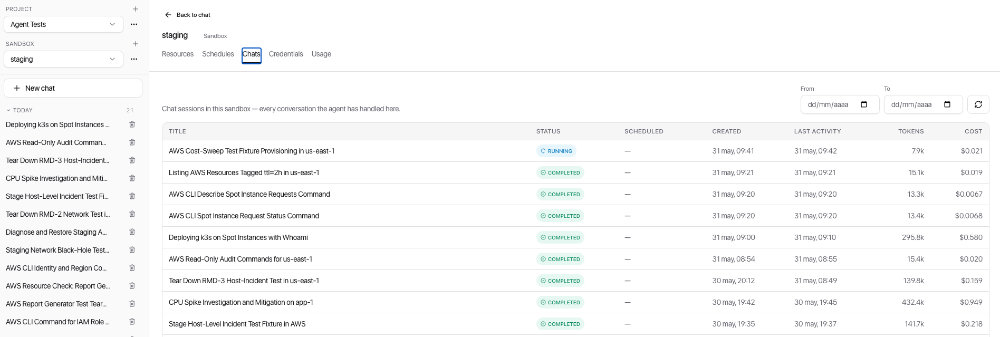

[← ClowdOps](README.md) · [← Schedules](schedules.md) · [External agents (MCP) →](mcp.md)

# Chats & History

**On this page:** [Columns](#columns) · [Source types](#source-types) · [Chat statuses](#chat-statuses) · [Inspecting a chat](#inspecting-a-chat)

The **Chats** tab gives you a unified audit log of every agent execution in the sandbox — whether it was started by you in chat or fired automatically by a schedule.

## Columns

| Column | Description |
| --- | --- |
| **Timestamp** | When the chat session was started |
| **Source** | How the session was initiated (see below) |
| **Name / Prompt** | Schedule name (for scheduled runs) or a snippet of your prompt (for interactive chats) |
| **Status** | Outcome of the session |
| **Model** | The LLM that ran the session (picked from your attached AI credentials) |
| **Tokens** | Total tokens consumed (prompt + completion), shown as `k` or `M` |
| **Cost** | Estimated USD spend for the LLM calls in this session |

## Source types

| Badge | Meaning |
| --- | --- |
| **Chat** | You started this from the chat interface |
| **Scheduled** | A schedule fired this automatically — the row links back to the parent schedule |
| **MCP** | An external agent (Claude Code, Cursor, …) started this over MCP — see [Connect External Agents (MCP)](mcp.md) |

Use the **Source** filter at the top of the list to narrow results.

## Chat statuses

| Status | Meaning |
| --- | --- |
| **Running** | Currently in progress |
| **Completed** | Finished successfully |
| **Failed** | Terminated with an error |
| **Cancelled** | You hit the Stop button before the agent finished |
| **Blocked** | A scheduled run stopped because policy denied a step it needed |
| **Budget exceeded** | The session was halted because it hit a USD cap |

## Inspecting a chat

Click any row to open the chat-session viewer. For scheduled runs the composer is hidden and a **"Scheduled run"** ribbon at the top links back to the parent schedule.

A **Debug** panel exposes the full step-by-step trace: each action's inputs, outputs, model used, token count, the action category ClowdOps assigned, and error details for failed steps.

> [!TIP]
> The Debug panel is the primary tool for understanding why a session produced unexpected results, was blocked by a guardrail, or failed partway through.

The list paginates 50 rows at a time. Use the **Refresh** button to pull the latest data if you are watching a session that is still in progress.
