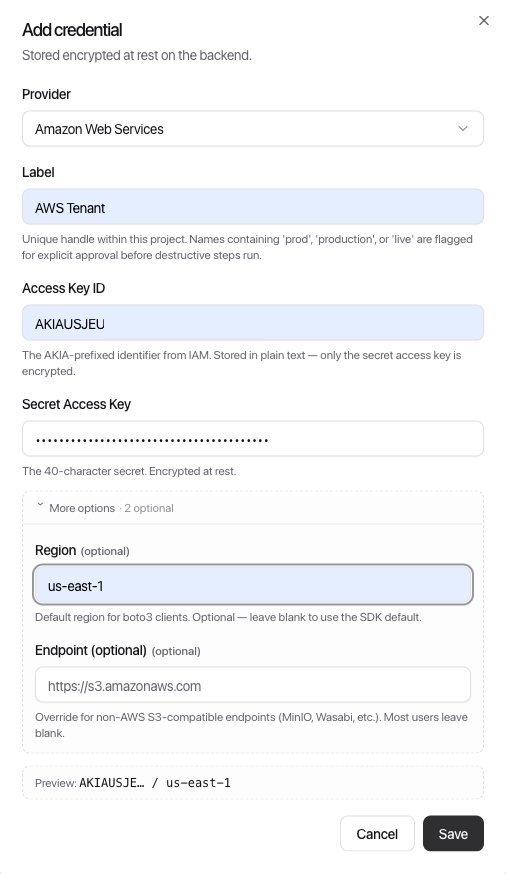
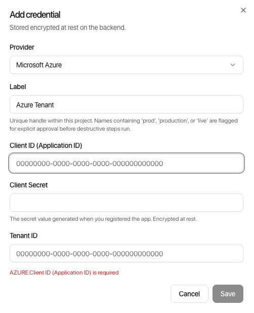

[← ClowdOps](../README.md) · [← Credential recipes](README.md)

# Cloud Credentials

**On this page:** [Read-only discovery](#read-only-discovery) · [Cost analysis](#cost-analysis) · [OCI — read-only and cost](#oci)

---

## Read-only discovery

The base credential for any cloud use case. Grants the agent permission to list and read resources across all services — no write or delete access.

### AWS

**What you'll create:** an IAM user with `ReadOnlyAccess`.

**Console**

1. IAM → Users → **Create user** → name it (e.g. `clowdops-auditor`). Do not enable console access.
2. Attach policies directly → search for `ReadOnlyAccess` → tick it → Next → Create user.
3. Click the new user → **Security credentials** tab → **Create access key** → select *Third-party service* → Next → Create.
4. Copy the **Access Key ID** and **Secret Access Key** immediately — AWS will not show the secret again.

**CLI**

```bash
aws iam create-user --user-name clowdops-auditor

aws iam attach-user-policy \
  --user-name clowdops-auditor \
  --policy-arn arn:aws:iam::aws:policy/ReadOnlyAccess

aws iam create-access-key --user-name clowdops-auditor
# Save AccessKeyId and SecretAccessKey from the output
```

**ClowdOps fields:** Access Key ID · Secret Access Key · Region (your primary region).



> `ReadOnlyAccess` covers `List`, `Describe`, and `Get` across virtually all AWS services and allows reading data inside resources (for example downloading S3 objects). It contains no `Put`, `Post`, `Update`, or `Delete` actions.

---

### GCP

**What you'll create:** a Service Account with `Viewer` at organisation level.

**Step 0 — enable the required APIs**

```bash
gcloud services enable \
  cloudresourcemanager.googleapis.com \
  cloudasset.googleapis.com \
  cloudbilling.googleapis.com \
  compute.googleapis.com \
  sqladmin.googleapis.com \
  cloudfunctions.googleapis.com \
  container.googleapis.com \
  pubsub.googleapis.com \
  iam.googleapis.com \
  --project=YOUR_PROJECT_ID
```

These APIs must be enabled in the project where you create the Service Account. Skipping any one causes the corresponding discovery step to time out or return a permission error.

**Console**

1. IAM & Admin → Service Accounts → **+ Create Service Account** → name it (e.g. `clowdops-auditor`) → Create and Continue → Done.
2. Copy the service account's email address (e.g. `clowdops-auditor@your-project.iam.gserviceaccount.com`).
3. Switch to **Organisation level** using the top project dropdown → IAM & Admin → IAM → **Grant Access**.
4. Paste the service account email → assign **Viewer** (`roles/viewer`) → Save.
5. Back in the project: IAM & Admin → Service Accounts → click the account → **Keys** → **Add Key** → Create new key → JSON → Create. A JSON file downloads — keep it secure.

**CLI**

```bash
export PROJECT_ID=your-project-id
export ORG_ID=your-org-id   # find with: gcloud organizations list
export SA_NAME=clowdops-auditor
export SA_EMAIL=${SA_NAME}@${PROJECT_ID}.iam.gserviceaccount.com

# Create the service account
gcloud iam service-accounts create $SA_NAME \
  --display-name="ClowdOps Auditor" \
  --project=$PROJECT_ID

# Grant Viewer at the organisation level
gcloud organizations add-iam-policy-binding $ORG_ID \
  --member="serviceAccount:${SA_EMAIL}" \
  --role="roles/viewer"

# Generate the JSON key
gcloud iam service-accounts keys create auditor-key.json \
  --iam-account=$SA_EMAIL \
  --project=$PROJECT_ID
```

**ClowdOps fields:** paste the entire contents of `auditor-key.json` into the *Service Account JSON key* field.

> `roles/viewer` grants metadata read access only (you can see that a bucket exists, not its contents). To read data inside resources, add `roles/storage.objectViewer` for Cloud Storage and `roles/bigquery.dataViewer` for BigQuery.

---

### Azure

**What you'll create:** an App Registration (Service Principal) with `Reader` at the Root Management Group.

**Console**

1. Microsoft Entra ID → App registrations → **+ New registration** → name it (e.g. `ClowdOpsAuditor`), single-tenant → Register.
2. On the Overview page, copy **Application (client) ID** and **Directory (tenant) ID**.
3. Certificates & secrets → **+ New client secret** → set a description and expiry → Add. Copy the **Value** immediately — Azure will not show it again.
4. Management groups → **Tenant Root Group** → Access control (IAM) → + Add → **Add role assignment** → Role: `Reader` → Members: select *User, group, or service principal* → search for `ClowdOpsAuditor` → Review + assign.

**CLI**

```bash
# Create App Registration and Service Principal
APP_ID=$(az ad app create --display-name ClowdOpsAuditor --query appId -o tsv)
az ad sp create --id $APP_ID
SP_OBJ_ID=$(az ad sp show --id $APP_ID --query id -o tsv)

# Generate a client secret (valid 2 years)
CLIENT_SECRET=$(az ad app credential reset \
  --id $APP_ID --years 2 --query password -o tsv)

# Assign Reader at the Root Management Group
# The root management group ID equals the tenant ID
TENANT_ID=$(az account show --query tenantId -o tsv)

az role assignment create \
  --assignee-object-id $SP_OBJ_ID \
  --assignee-principal-type ServicePrincipal \
  --role Reader \
  --scope "/providers/Microsoft.Management/managementGroups/${TENANT_ID}"

echo "Tenant ID:     $TENANT_ID"
echo "Client ID:     $APP_ID"
echo "Client Secret: $CLIENT_SECRET"
echo "Subscription:  $(az account show --query id -o tsv)"
```

**ClowdOps fields:** Tenant ID · Client ID · Client Secret · Subscription ID (any subscription in scope).



> `Reader` grants Control Plane access — you can see resource properties. To read actual data inside resources (blob contents, Key Vault secrets, Service Bus messages), add the relevant Data Plane roles: `Storage Blob Data Reader`, `Key Vault Secrets User`, and so on.

---

## Cost analysis

Start with the **[read-only discovery](#read-only-discovery)** credential above, then add the billing permissions below. Everything else stays the same.

### AWS

**Two extra steps:**

**1. Enable IAM billing access (root account required — one-time)**

Log in as the root account → click your account name (top right) → Account → scroll to *IAM User and Role Access to Billing Information* → Edit → tick *Activate IAM Access* → Update. Without this toggle, billing policies attached to IAM users have no effect regardless of what's attached.

**2. Attach the billing policy**

```bash
aws iam attach-user-policy \
  --user-name clowdops-auditor \
  --policy-arn arn:aws:iam::aws:policy/AWSBillingReadOnlyAccess
```

This grants read access to Cost Explorer, Budgets, and usage reports.

> **Cost Explorer API pricing:** each API request costs $0.01. ClowdOps caches cost data within a session, but avoid scheduling cost-heavy prompts at a high frequency.

---

### GCP

**Two extra steps:**

**1. Enable billing export to BigQuery**

GCP's Cloud Billing API only returns catalog pricing, not historical usage costs. To get actual spend data, export it to BigQuery first: Billing → **Billing export** → Standard usage cost → select or create a BigQuery dataset → Save.

**2. Grant billing and BigQuery access**

```bash
# Billing Account Viewer (account-level metadata)
gcloud beta billing accounts add-iam-policy-binding YOUR_BILLING_ACCOUNT_ID \
  --member="serviceAccount:${SA_EMAIL}" \
  --role="roles/billing.viewer"

# BigQuery access on the billing export project/dataset
gcloud projects add-iam-policy-binding YOUR_BILLING_PROJECT_ID \
  --member="serviceAccount:${SA_EMAIL}" \
  --role="roles/bigquery.dataViewer"

gcloud projects add-iam-policy-binding YOUR_BILLING_PROJECT_ID \
  --member="serviceAccount:${SA_EMAIL}" \
  --role="roles/bigquery.user"
```

Find your billing account ID at Billing → Account Management (format: `XXXXXX-XXXXXX-XXXXXX`).

> Once the export is live, the agent queries your billing data via SQL against the BigQuery dataset. First export typically arrives within 24 hours of enabling it.

---

### Azure

**One extra step:** assign `Cost Management Reader` at the billing scope.

```bash
az role assignment create \
  --assignee-object-id $SP_OBJ_ID \
  --assignee-principal-type ServicePrincipal \
  --role "Cost Management Reader" \
  --scope "/providers/Microsoft.Billing/billingAccounts/YOUR_BILLING_ACCOUNT_ID"
```

Via portal: Cost Management + Billing → select your Billing Account or Billing Profile → Access control (IAM) → + Add → Add role assignment → `Cost Management Reader` → assign to `ClowdOpsAuditor`.

> On Enterprise Agreement subscriptions, the billing scope structure differs — you may need to assign the role at the EA enrollment level. Check which scope your Cost Management dashboard is scoped to.

---

## OCI

OCI is different from the other cloud providers in one important way: **cost access is built into the same credential** — there is no separate billing export or second role to add. The `read usage-reports` policy statement is all that is needed on top of resource discovery.

### Read-only discovery and cost analysis

**What you'll create:** an IAM user in a dedicated group, with a read-only policy and an API signing key.

**Phase 1 — create the auditor group**

1. OCI Console → navigation menu → **Identity & Security** → **Domains** → your domain (usually `Default`) → **Groups**.
   *(On older tenancies without Identity Domains: **Identity & Security** → **Groups**.)*
2. Click **Create group** → name it (e.g. `ClowdOpsAuditors`) → **Create**.

**Phase 2 — create the policy**

Policies are written at the tenancy (root compartment) level so the group can see all resources.

1. **Identity & Security** → **Policies** → set the compartment selector to the **root** compartment.
2. Click **Create Policy** → name it (e.g. `ClowdOpsAuditor-ReadOnly`) → toggle **Show manual editor** → paste:

   ```
   Allow group ClowdOpsAuditors to read all-resources in tenancy
   Allow group ClowdOpsAuditors to read usage-reports in tenancy
   ```

   - `read all-resources` — covers metadata discovery and reading data inside resources (compute instances, VCNs, block volumes, Object Storage objects, IAM users, compartments, and more). The `read` verb cannot create, modify, or delete anything.
   - `read usage-reports` — grants access to the Usage API for historical cost and usage data. Without it those calls fail.

3. Click **Create**.

> **Granular alternative.** If a tenancy-wide `read all-resources` is too broad for your security policy, replace it with per-resource-family statements. See your OCI documentation for the full list of resource families (`instance-family`, `virtual-network-family`, `volume-family`, `buckets`, and so on).

**Phase 3 — create the user**

1. **Identity & Security** → **Domains** → your domain → **Users** (or **Identity & Security** → **Users** on non-domain tenancies).
2. **Create user** → choose **IAM user** (not federated/SSO — API signing requires a local IAM user) → name it (e.g. `clowdops-auditor`). No console password needed.
3. Open the new user → **Groups** → **Add user to group** → select `ClowdOpsAuditors`.

**Phase 4 — generate the API signing key**

OCI authenticates API calls with an RSA signing key — you upload the public half and keep the private PEM.

```bash
mkdir -p ~/.oci
openssl genrsa -out ~/.oci/oci_api_key.pem 2048
chmod 600 ~/.oci/oci_api_key.pem
openssl rsa -pubout -in ~/.oci/oci_api_key.pem -out ~/.oci/oci_api_key_public.pem
```

> Do not add a passphrase (`-aes256`). A passphrase-protected key cannot be used for unattended API access.

Upload the public key to the user:

1. Open the user → **API keys** → **Add API key** → **Paste a public key** → paste the contents of `~/.oci/oci_api_key_public.pem` → **Add**.
2. OCI displays a **Configuration file preview** — copy the **fingerprint**, **tenancy OCID**, **user OCID**, and **region** from it. You need all four.

**CLI alternative (Phases 1–4)**

```bash
export OCI_TENANCY_OCID=ocid1.tenancy.oc1...   # your tenancy OCID

# Group
GROUP_OCID=$(oci iam group create \
  --name ClowdOpsAuditors \
  --description "ClowdOps read-only auditor" \
  --query 'data.id' --raw-output)

# Policy (attach to root compartment = tenancy OCID)
oci iam policy create \
  --compartment-id "$OCI_TENANCY_OCID" \
  --name ClowdOpsAuditor-ReadOnly \
  --description "Read-only discovery + usage" \
  --statements '["Allow group ClowdOpsAuditors to read all-resources in tenancy","Allow group ClowdOpsAuditors to read usage-reports in tenancy"]'

# User
USER_OCID=$(oci iam user create \
  --name clowdops-auditor \
  --description "ClowdOps auditor" \
  --query 'data.id' --raw-output)

# Add user to group
oci iam group add-user --user-id "$USER_OCID" --group-id "$GROUP_OCID"

# Key pair
openssl genrsa -out ~/.oci/oci_api_key.pem 2048 && chmod 600 ~/.oci/oci_api_key.pem
openssl rsa -pubout -in ~/.oci/oci_api_key.pem -out ~/.oci/oci_api_key_public.pem

# Upload public key (prints fingerprint)
oci iam user api-key upload --user-id "$USER_OCID" --key-file ~/.oci/oci_api_key_public.pem
```

**Phase 5 — collect the credential values**

| Value | Where to find it |
| --- | --- |
| **Tenancy OCID** | Profile menu (top-right) → **Tenancy: \<name\>** → copy OCID |
| **User OCID** | The user's detail page → copy OCID |
| **Key Fingerprint** | Shown next to the uploaded key under the user's **API keys** (`aa:bb:cc:…`) |
| **API Private Key (PEM)** | Contents of `~/.oci/oci_api_key.pem` |
| **Region** | Home region identifier, e.g. `us-phoenix-1` — shown in the config file preview |

**ClowdOps fields:** Tenancy OCID · User OCID · Key Fingerprint · API Private Key (PEM) · Region (optional — leave blank to use the SDK default).

> **Cost is built in.** Unlike GCP, there is no billing export to configure. The `read usage-reports` policy statement gives the agent direct access to the OCI Usage API for historical cost and usage data at daily and monthly granularity.
