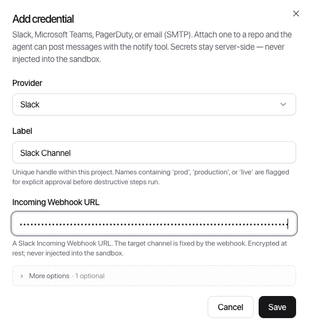
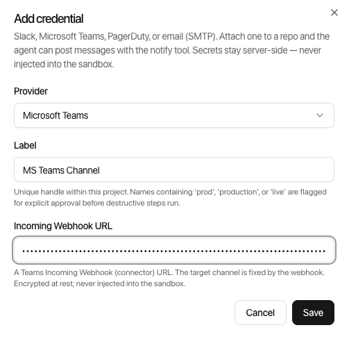
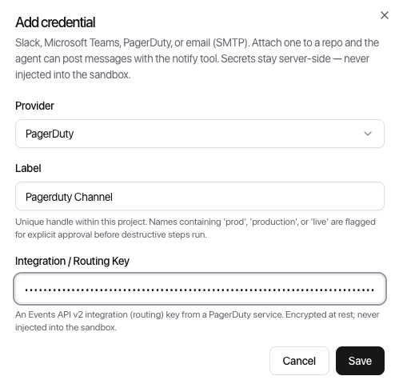
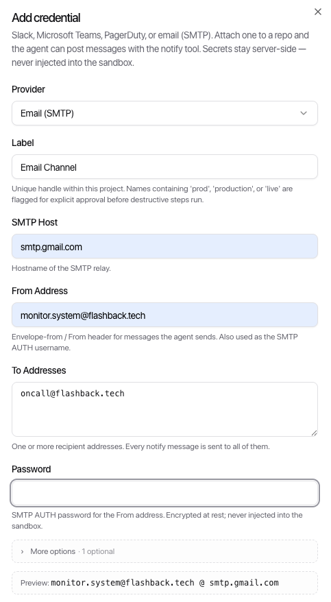

[← ClowdOps](../README.md) · [← Credential recipes](README.md)

# Notification Channel Credentials

**On this page:** [Slack](#slack) · [Microsoft Teams](#microsoft-teams) · [PagerDuty](#pagerduty) · [Telegram](#telegram) · [SMTP (email)](#smtp-email)

Notification channel credentials are created at the project level (Project → Credentials → Notifications) and then attached to individual sandboxes. Only attached channels are reachable by the agent.

Give each channel a descriptive **label** — this is what you (and the agent) use to address it, for example `oncall`, `#infra-alerts`, or `cost-reports`.

> ClowdOps holds notification credentials and makes the outbound request on your behalf — the secret is never handed to the agent or exposed anywhere in the conversation.

---

## Slack

**What you'll create:** an incoming webhook for a Slack channel.

1. Go to [api.slack.com/apps](https://api.slack.com/apps) → **Create New App** → **From scratch**.
2. Name the app (e.g. `ClowdOps`) and select the workspace → **Create App**.
3. In the left menu, select **Incoming Webhooks** → toggle **Activate Incoming Webhooks** → **Add New Webhook to Workspace**.
4. Pick the channel you want the agent to post to → **Allow**.
5. Copy the **Webhook URL** (format: `https://hooks.slack.com/services/T.../B.../...`).

**ClowdOps fields:**

| Field | Value |
| --- | --- |
| Webhook URL | Paste the URL from step 5 |
| Channel hint | Optional — a `#channel-name` reminder shown in the credential list |

---

## Microsoft Teams

**What you'll create:** an incoming webhook for a Teams channel.

1. In Microsoft Teams, open the channel you want notifications posted to.
2. Click **···** (More options) next to the channel name → **Connectors** (or **Manage channel** → **Connectors**).
3. Search for **Incoming Webhook** → **Add** → **Add** again to confirm.
4. Give the webhook a name (e.g. `ClowdOps`) and optionally upload an icon → **Create**.
5. Copy the **webhook URL** and click **Done**.

**ClowdOps fields:**

| Field | Value |
| --- | --- |
| Webhook URL | Paste the URL from step 5 |

---

## PagerDuty

**What you'll create:** an Events API v2 integration on a PagerDuty service.

1. In PagerDuty, go to **Services** → select the service you want to route alerts to (or create a new one).
2. Go to the **Integrations** tab → **Add an integration** → search for **Events API v2** → **Add**.
3. Click the integration name to expand it → copy the **Integration Key** (also called the routing key).

**ClowdOps fields:**

| Field | Value |
| --- | --- |
| Routing key | Paste the Integration Key from step 3 |

> The agent maps `severity: critical` to PagerDuty `critical` and lower severities to `warning` or `info` — all trigger the service's escalation policy. PagerDuty is selected preferentially when a sandbox has multiple channels and the agent uses `critical` severity.

---

## Telegram

**What you'll create:** a Telegram **bot** and the **chat ID** it posts to.

1. In Telegram, open **@BotFather** → send `/newbot` → follow the prompts (name + username) → copy the **bot token** (format `123456789:AAE…`).
2. Decide the destination chat and get its **chat ID**:
   - **Direct message:** message your bot once, then open `https://api.telegram.org/bot<token>/getUpdates` and read `message.chat.id`.
   - **Group:** add the bot to the group, send a message, and read the (negative) `chat.id` the same way.
   - **Channel:** add the bot as an admin and use `@channelusername`.

**ClowdOps fields:**

| Field | Value |
| --- | --- |
| Bot Token | Paste the token from step 1 |
| Chat ID | The numeric id (or `@channelusername`) from step 2 |
| Topic / Thread ID | Optional — for forum-style groups, the topic to post into |

> [!TIP]
> A Telegram channel is also a **control surface**: once attached to a sandbox you can link a chat and drive the agent from Telegram (prompts, Allow/Deny approvals, answers). See [Telegram](../tg.md).

---

## SMTP (email)

**What you'll create:** a set of outbound SMTP credentials for an email account or relay.

Use a dedicated sending account (for example a Google Workspace service account, a SendGrid SMTP relay, or an AWS SES SMTP credential) rather than a personal inbox.

**ClowdOps fields:**

| Field | Value |
| --- | --- |
| Host | SMTP server hostname (e.g. `smtp.gmail.com`, `smtp.sendgrid.net`) |
| Port | Usually `587` (STARTTLS) or `465` (TLS). Defaults to `587` if left blank. |
| Username | SMTP authentication username |
| Password | SMTP authentication password or app password |
| From address | Sender address that appears in the email `From:` field |
| To address(es) | One or more recipient addresses; all receive every notification |

> TLS is required by default. Plain-text SMTP is not supported.
