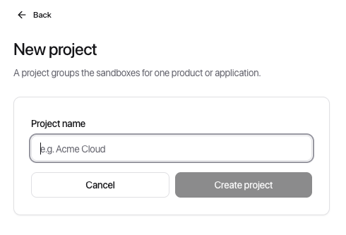
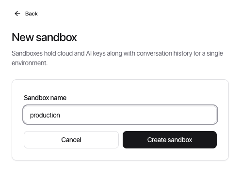

[← ClowdOps](README.md) · [Workspace & credentials →](your-workspace.md)

# Getting Started

**On this page:** [Sign up](#sign-up) · [Navigating back to onboarding](#navigating-back-to-onboarding)

This page walks you through creating an account, completing onboarding, and reaching the ClowdOps chat interface for the first time.

## Sign up

Follow the steps below in order.

### Step 1: Create your account

Go to the ClowdOps sign-up page and register with your email and a password, or use a social provider (Google, Microsoft, or GitHub).

After registering with email, check your inbox and click the verification link before continuing.

> [!NOTE]
> If the sign-up page shows an **"Invite only"** message instead of the registration form, ClowdOps is running in private preview mode. New accounts are created by invitation only — check your inbox for an invite link, or contact your team's ClowdOps admin. If you already have an account (for example you were invited by an admin), use the **Sign in** link instead.

### Step 2: Create your organisation

On first login, the onboarding wizard launches automatically. Enter your organisation name and an optional website. These are used for billing and team management.

### Step 3: Set spending limits

Optionally set guardrails for the whole organisation before you create anything: a USD budget cap and the [action categories](guardrails.md) the agent is allowed to use. This step is **skippable** — you can leave the defaults and tune limits later from any **Usage** tab. Whatever you set here becomes the org-level ceiling that projects and sandboxes inherit.

### Step 4: Create your first project

A **project** groups related sandboxes. Give it a descriptive name (for example `Production`, `Data Platform`, or `Infra Automation`).

### Step 5: Create your first sandbox

A **sandbox** is the execution environment where the agent runs. It holds your credentials, templates, and run history. Name it to reflect its scope (for example `AWS prod` or `GCP analytics`).

> [!NOTE]
> New projects and sandboxes **inherit their permission grants** (the allowed action categories and failure caps) from the level above them, so each one starts with sensible limits rather than empty or fully locked. You can tighten any of them afterwards — a child can never exceed its parent. See [Guardrails & cost caps](guardrails.md).

### Step 6: You are in

After completing onboarding you land in the Chat view with your new sandbox selected. You can now add credentials and start chatting.

## Navigating back to onboarding

If you need to create additional projects or sandboxes later, use the **project selector** and **sandbox selector** dropdowns in the left sidebar.

> [!TIP]
> You can belong to multiple organisations. If you receive an invite link from a colleague, accepting it will add you to their org alongside your own.
