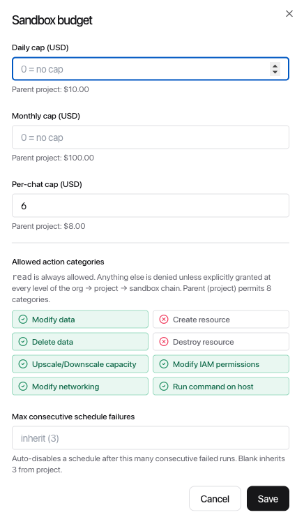

[← ClowdOps](README.md) · [← Resources](resources.md) · [Account & settings →](../common/settings.md)

# Guardrails & cost caps

**On this page:** [The two axes](#the-two-axes) · [Categorical grants](#categorical-grants) · [USD cost caps](#usd-cost-caps) · [Hierarchical inheritance](#hierarchical-inheritance) · [Where to configure](#where-to-configure) · [Who can edit what](#who-can-edit-what) · [In-chat confirmation](#in-chat-confirmation) · [Scheduled runs](#scheduled-runs) · [Auto-disable on consecutive failures](#auto-disable-on-consecutive-failures)

ClowdOps gives the agent enough freedom to be useful and enough rails to be safe. Two independent controls govern what an agent run can do and how much it can spend.

## The two axes

| Axis | Question it answers | Effect when violated |
| --- | --- | --- |
| **Categorical grants** | *"Is this kind of action allowed at all?"* | The agent is told no; the call never reaches your cloud |
| **USD cost caps** | *"Has this scope spent too much?"* | The chat turn is halted (`budget exceeded`) |

The two are independent. A scope can grant all categories but cap spend tightly, or grant nothing and have no caps at all — the action is denied either way.

## Categorical grants

Eight mutating categories cover the actions the agent can take. Read access is implicit and always allowed.

| Category | Examples |
| --- | --- |
| **Modify data** | Updating an object in place, writing to a database, changing a parameter store value |
| **Create resource** | Provisioning a new VM, bucket, database, or Terraform `apply` |
| **Delete data** | Removing remote objects or rows: `aws s3 rm`, `DELETE` / `TRUNCATE` against a remote database |
| **Destroy resource** | Terminating instances, deleting databases, `terraform destroy` |
| **Upscale / downscale capacity** | Resizing an instance, modifying an autoscaling group, changing an RDS instance class |
| **Modify IAM permissions** | Creating roles or policies, attaching policies, granting bindings |
| **Modify networking** | Editing security groups, route tables, firewall rules, VPCs |
| **Run command on host** | `kubectl exec`, `aws ssm send-command`, `gcloud compute ssh` — anything that runs code inside a target host or container |

A scope **grants** the categories it permits. Anything not granted is denied — the agent receives a denial and can react.

> [!NOTE]
> The agent works in an isolated environment that has no direct access to your infrastructure. Only the specific actions it takes through ClowdOps — querying your cloud, running commands on hosts you've credentialed — are gated by these categories.

### Inside the sandbox vs outside

The categories gate state changes that reach **outside** the sandbox — your cloud control planes (`aws` / `gcloud` / `az` / `oci`), remote hosts (`ssh` / `scp` / `rsync`), external HTTP writes, and remote databases.

Work the agent does **inside its own disposable sandbox** — creating, copying, moving, or deleting local files (`rm`, `cp`, `mv`, `mkdir`, `chmod`), output redirects (`>`, `>>`, `tee`), archiving (`tar`, `zip`), and managing local processes — is **not** gated by any category; it falls through to read-level. The sandbox is throwaway, so there is nothing there to protect, and you won't be interrupted by spurious confirmation prompts for ordinary local file work. The same command shape against a *remote* target (for example `aws s3 rm`, not a local `rm`) is what triggers the matching category.

### When the agent runs an unfamiliar command

Most commands are classified by their shape. If a command warrants scrutiny but can't be confidently classified, it is treated as **unknown** rather than waved through — which means it prompts for confirmation in an interactive chat and is denied in an unattended [scheduled run](#scheduled-runs). The system fails safe, not open.

## USD cost caps

Three caps control spend in dollars:

- **Daily cap** — total spend within a rolling 24-hour window.
- **Monthly cap** — total spend within the calendar month.
- **Per-chat-session cap** — total spend within a single chat session.

When a cap is hit, the in-flight chat turn ends with status **budget exceeded** and the agent reports back what it accomplished.

> [!TIP]
> The project and sandbox page headers carry a compact **budget pill** showing today's spend against the effective daily cap (the scope's own cap, or the parent's if it hasn't set one). Click it to jump to that scope's Usage tab. Inside a chat, the same information is in the [live cost & model badge](chat.md#live-cost--model-badge).

> [!TIP]
> Per-chat caps are especially useful for catching runaway loops. A modest per-chat cap (for example `$5`) bounds the cost of any single thing the agent tries to do, even if your monthly cap is much higher.

## Hierarchical inheritance

Both axes flow top-down through your account:

```
Organisation
└── Project
    └── Sandbox
        └── Chat session
```

- A child scope **cannot exceed** its parent — granting `delete_data` at a sandbox requires the project (and org) to also grant it; setting a $1000/month cap at a project requires the org to allow at least that.
- A child can be **stricter** than its parent — a sandbox can refuse a category the org allows, or set a tighter cap.
- The UI enforces this when you save (it surfaces the parent's value as a soft hint and rejects out-of-bounds inputs); the backend re-validates on every write.

> [!NOTE]
> A newly created project, sandbox, or [schedule](schedules.md) **inherits its parent's granted categories and failure caps at creation time**, so it starts usable instead of empty or fully locked. You can tighten it afterwards — but never beyond what the parent allows.

## Where to configure

The same editor opens at each scope from its **Usage** tab:

| Scope | Path |
| --- | --- |
| Organisation | Settings → Usage → pencil icon |
| Project | Project → Usage → pencil icon |
| Sandbox | Sandbox → Usage → pencil icon |
| Chat session | (per-chat budget surfaced from the chat header) |



Each editor shows the parent scope's values as labelled hints (for example *"Inherited from project: $50.00/day"*) and lists the categories the parent permits — anything the parent didn't grant is greyed out.

## Who can edit what

UI affordances are hidden when you don't have permission; the backend re-checks every write.

| Scope | Role required |
| --- | --- |
| Organisation | Org **Owner** / **Administrator**, or a role with the **Workspaces** permission bit |
| Project | Project **Admin**, or any of the org roles above |
| Sandbox | Same as the parent project (project admins manage all sandboxes under their project) |
| Chat session | Only the user who created the chat |

## In-chat confirmation

A granted category is allowed by policy — but you can still ask the agent to **pause and confirm** with you before each such call within an interactive chat. This is the `confirm_categories` setting on the chat session.

By default, **all eight mutating categories prompt for confirmation** in interactive chat (safe default). The confirmation card lets you:

- **Allow once** — the agent dispatches just this call.
- **Allow for the rest of this session** — tick the sticky-allow checkbox; future calls of the same category skip the confirmation prompt for the remainder of the session.
- **Deny** — the agent gets a denial and the optional note you wrote.

The confirmation axis is purely UX — it only fires for categories the grant chain already permits. See [Confirming a sensitive action](chat.md#confirming-a-sensitive-action) for the in-chat experience.

## Scheduled runs

A scheduled run has no human attached, so the confirmation card has nowhere to land. The rules change accordingly:

- The agent **cannot ask clarifying questions** (the `ask_user` tool is removed).
- Any category that would normally request confirmation is **denied** unless the schedule's own allowlist explicitly pre-approves it.
- The effective allowlist for a scheduled action is **the sandbox grant ∩ the schedule's allowlist**. Both must permit the category.

Set the per-schedule allowlist when [creating a schedule](schedules.md#allowed-actions). Keep it to the minimum the prompt actually needs.

## Auto-disable on consecutive failures

To prevent a broken schedule from burning budget tick after tick, every scope carries a **max consecutive failures** setting. When a schedule fails this many times in a row it disables itself automatically; you re-enable it after fixing the underlying issue.

The setting is inheritable: a per-schedule override beats sandbox, which beats project, which beats org, which falls back to the platform default (**5**). The strictest non-empty value in the chain wins. The schedule editor shows you the value it inherits when you leave the override blank.
