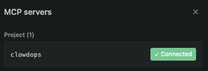
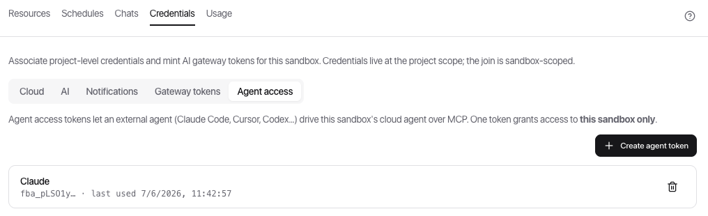
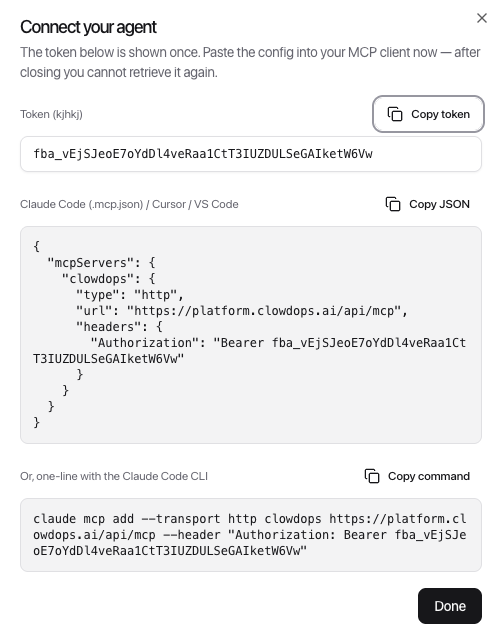
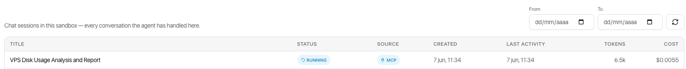

[← ClowdOps](README.md) · [← Chats & history](chats.md) · [Resources →](resources.md)

# Connect External Agents (MCP)

**On this page:** [What this is](#what-this-is) · [Create an agent token](#1-create-an-agent-token) · [Connect your client](#2-connect-your-client) · [What the external agent can do](#what-the-external-agent-can-do) · [Confirmations & guardrails](#confirmations--guardrails) · [Where MCP chats appear](#where-mcp-chats-appear) · [Security notes](#security-notes)

ClowdOps exposes each sandbox's agent over the **Model Context Protocol (MCP)**, so external coding agents — **Claude Code, Cursor, Codex, VS Code** — can drive it directly from your editor. You prompt the ClowdOps agent from inside your tool, and it plans and executes against your cloud the same way it does in the web chat — same credentials, same guardrails, same budget.

## What this is

You authenticate the connection with a per-sandbox **agent access token**. The token tells ClowdOps which sandbox to drive; everything else — credential scope, action-category guardrails, confirmations, USD budgets — is applied by ClowdOps exactly as in the web app. Nothing about MCP relaxes your safety posture.

> [!NOTE]
> **One token = one sandbox.** A token grants access to a single sandbox. Mint a separate token (and add a separate MCP server entry) for each sandbox you want to reach.

## 1. Create an agent token

Open the sandbox's **Credentials** tab and switch to **Agent access**, then **Create agent token**. Give it a label that identifies the client or machine using it (for example `claude-code`, `cursor`, or `laptop`).

The list shows each token's label, a non-secret prefix (`fba_…`), and when it was last used, so you can spot and rotate stale tokens. Deleting a token revokes it immediately and frees the label for reuse.

## 2. Connect your client

Right after you create a token, ClowdOps shows the **Connect your agent** dialog. The plaintext token (`fba_…`) is displayed **only once** here — ClowdOps stores only a hash and can never show it again. Copy it now; if you lose it, delete the token and create a new one.

The dialog gives you two ready-to-paste options with the correct URL and token already filled in:

- **Config block** — for Claude Code (`.mcp.json`), Cursor, or VS Code. Paste it into your client's MCP settings.
- **CLI one-liner** — `claude mcp add --transport http clowdops <url> --header "Authorization: Bearer fba_…"` for the Claude Code CLI.

| Client | How to add |
| --- | --- |
| **Claude Code** | Paste the config into `.mcp.json` (project) or `~/.claude.json` (user), or run the `claude mcp add` one-liner. |
| **Cursor** | Settings → MCP → Add server → HTTP, then paste the URL and the `Authorization` header. |
| **VS Code** | Add an HTTP MCP server in your MCP settings with the same URL and header. |
| **Claude Desktop** | Use a remote-MCP bridge (e.g. `npx mcp-remote <url> --header "Authorization: Bearer fba_…"`) in `claude_desktop_config.json`. |

> [!WARNING]
> The token is a secret. Don't commit a config file that contains it — keep it in a per-user/local config, or git-ignore the file you paste it into.

After your client reloads, it should show the **clowdops** server connected (see the panel at the top of this page). You can now prompt the ClowdOps agent from inside your tool.

## What the external agent can do

Once connected, your client can:

- **Start a chat session** and **send prompts** to the sandbox's agent, receiving the agent's final answer plus a summary of the tools it used and the cost.
- **Continue an existing conversation**, **list** and **inspect** past sessions.
- **Approve or deny** an action the agent paused on, **answer** a clarifying question, or **cancel** a running turn.

While a turn runs, progress (which tool the agent is running, what it's doing) streams back into your client live, then the final result arrives.

## Confirmations & guardrails

MCP changes *how you reach* the agent, not *what it's allowed to do*. Every guardrail still applies:

- Mutating actions (run command on host, modify IAM, delete data, …) are gated by the same **action-category permissions** at org → project → sandbox.
- When the agent reaches for a guarded action, the turn **pauses for confirmation** — your client surfaces the pending action (tool, arguments preview, category, and why it's asking), and you approve or deny it. You can also approve for the rest of the session.
- Credential scope and **USD budgets** are unchanged.

See [Guardrails & cost caps](guardrails.md) for the full permission and budget model.

## Where MCP chats appear

Sessions started over MCP are first-class chats. They show up in the sandbox's **Chats** tab with an **MCP** badge in the **Source** column, alongside interactive **Chat** and **Scheduled** runs — fully auditable, with the same status, token, and cost columns and the same Debug trace.

See [Chats & History](chats.md) for the audit view.

## Security notes

- **Scoped to one sandbox.** A token can only drive the sandbox it was minted for.
- **Hashed at rest.** Only a hash of the token is stored; the plaintext is shown once at creation.
- **Instant revocation.** Deleting a token blocks the next request with it immediately.
- **Attributed.** MCP activity is attributed to the user who created the token, for audit and billing.
- **Guardrails enforced.** The agent operates within the same credential scope, action-category grants, confirmations, and budgets as the web app.
