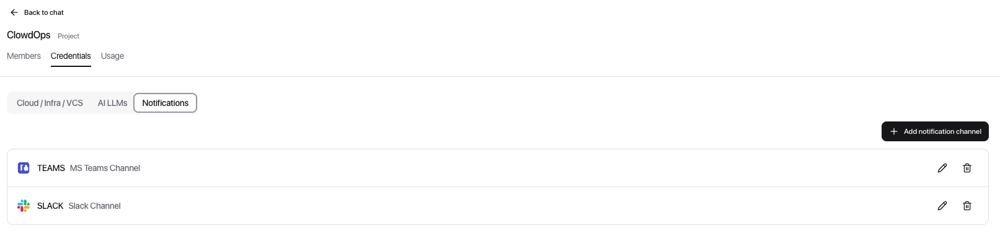
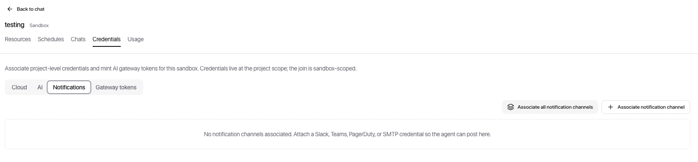
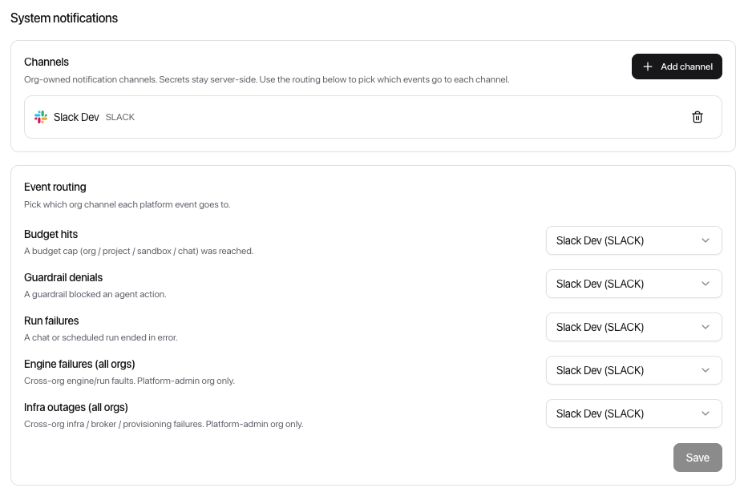

[← ClowdOps](README.md)

# Notifications

**On this page:** [What it is](#what-it-is) · [Setting up channels](#setting-up-channels) · [Sending notifications from chat](#sending-notifications-from-chat) · [Schedule digests](#schedule-digests) · [Platform notifications](#platform-notifications)

Notification channels let the agent push messages to where your team already is — Slack, Microsoft Teams, PagerDuty, Telegram, or email — without any credentials being exposed in the sandbox.

> [!TIP]
> **Telegram is two-way.** It works as an outbound channel like the others *and* as a control surface: a linked Telegram chat can drive the sandbox's agent (prompts, approvals, answers). See [Telegram](tg.md) for the inbound side.

ClowdOps sends notifications in two families, covered on this page:

| Family | Who fires it | What it covers |
| --- | --- | --- |
| **Agent notifications** | The agent (in chat) or the platform (after a schedule) | Findings and run summaries — see below |
| **[Platform notifications](#platform-notifications)** | The platform engine, deterministically | Account-level events: budget caps hit, guardrail denials, run failures |

---

## What it is

Once a notification channel is attached to a sandbox, the agent gains the ability to send outbound messages. This works in two complementary ways:

| Mode | When it fires | Who triggers it |
| --- | --- | --- |
| **In-chat notify** | Any point during an interactive or unattended session | The agent, when it decides a finding warrants it |
| **Schedule digest** | Automatically after every scheduled run completes | The platform, regardless of model behaviour |

Both modes use the same channel credentials and the same transports. They are independent — a scheduled run can emit a mid-run `notify` call *and* receive a digest at the end.

> [!NOTE]
> Sending a notification is **always allowed** — it is not gated by the categorical grant system the way mutating cloud actions are. The reasoning: the agent can only post to channels you explicitly attached to the sandbox, and the webhook secret never leaves the server. The worst case is a noisy message to your own channel, not a cloud-side change.

---

## Setting up channels

Notification channels are credentials with their own tab. The setup follows the same two-step flow as other credentials:

**Step 1 — create the channel at the project level**

Open **Project → Credentials → Notifications** → **Add notification channel**. Select the provider and fill in the required fields. See [Notification channel setup](credentials/notify.md) for provider-specific instructions (Slack, Teams, PagerDuty, Telegram, SMTP).

**Step 2 — attach the channel to a sandbox**

Open the sandbox → **Credentials → Notifications** → **Associate notification channel** (or **Associate all notification channels**). Only attached channels are reachable by the agent during a run.

Give each channel a clear **label** (for example `oncall`, `#infra-alerts`, `cost-reports`). The label is how the agent and schedule digest address the channel — it does not need to match the actual channel name in Slack or Teams.

---

## Sending notifications from chat

Once a channel is attached to the sandbox, the agent can call the `notify` tool at any point in a conversation — interactive or scheduled. Tell it naturally:

- *"After you scan the buckets, post a Slack summary of any public ones."*
- *"Page on-call via PagerDuty if you find a critical exposure."*
- *"Send me an email with the cost report when you're done."*
- *"Post the audit summary to Telegram when you're done."*
- *"If you detect active errors in the logs, notify the #infra-alerts channel immediately — don't wait until you finish."*

### How the agent picks a channel

- If the sandbox has **one** attached channel, that is the default.
- If there are **multiple**, the agent picks by the label you used in your message (case-insensitive). You can be explicit: *"post to the oncall channel"*.
- Use **severity** to control urgency and routing: `info` for routine summaries, `warning` for anomalies, `critical` for things that should page someone now. When a PagerDuty channel is attached, `critical` routes there preferentially.

### What you see in the chat

The `notify` call appears inline as a tool step (like any other tool). The agent reports back whether delivery succeeded. If it fails (for example a bad webhook), it tells you and you can decide whether to retry.

---

## Schedule digests

Scheduled runs can post an automatic summary to a notification channel after each firing. This is the "always-on alerting floor" for unattended work — the digest fires even if the agent never called `notify` mid-run.

Configure this when creating or editing a schedule under the **Notifications** section of the schedule editor:

| Field | What it does |
| --- | --- |
| **Channel** | The notify channel label to send the digest to. *Off — no digest* disables it. |
| **Send on** | Filters which outcomes trigger a digest: Always · On success · On failure · On blocked |

**Send-on options:**

| Option | Sends when |
| --- | --- |
| **Always** | Every run, regardless of outcome — useful for regular reports where "all clear" is itself signal |
| **On success** | Only when the run finished cleanly |
| **On failure** | Only when the run crashed, hit the runtime cap, or exceeded budget |
| **On blocked** | Only when policy denied a step the agent needed |

### Mid-run notify vs digest — which to use

They are complementary, not alternatives:

- Use **mid-run `notify`** in your prompt for high-severity findings that shouldn't wait for the run to finish: *"if you find a publicly exposed storage bucket, page on-call immediately."* The agent sends this as soon as it detects the condition.
- The **digest** is the reliable baseline — it fires after every run and summarises what happened, including the agent's conclusion and the run outcome. It gives you visibility even when the agent finds nothing worth paging about.

A single schedule can do both: instruct the agent to `notify` on critical findings mid-run, and set a digest channel to always receive the end-of-run summary.

---

## Platform notifications

Everything above is **agent** notification — the agent (or a schedule) addressing a channel attached to a sandbox. Separately, ClowdOps can alert you about **account-level events** that the platform detects on its own, regardless of any model behaviour. These are configured once per organisation and routed to org-level channels.

> [!NOTE]
> Platform notifications are fired **deterministically by the engine**, not by the LLM. A budget cap or a guardrail denial is a fact the platform knows, so the alert does not depend on the agent deciding to send it.

### Event types

| Event | Fires when |
| --- | --- |
| **Budget** | An org / project / sandbox spend cap is reached |
| **Guardrail denial** | Policy blocked an action the agent attempted (a category that wasn't granted) |
| **Run failure** | A chat or scheduled run failed (crashed, hit the runtime cap, or exceeded budget) |

High-risk denials (deleting data, destroying a resource, modifying IAM or networking) and budget caps are treated as higher severity.

### Configuring routing

Open **Settings → System notifications**. Each event type is routed independently to one of your organisation's notification channels — so you can send budget alerts to Slack and guardrail denials to PagerDuty, for example.

1. **Add org channels** — the system-notifications page has its own channel manager. Add the org-level Slack, Microsoft Teams, PagerDuty, Telegram, or email (SMTP) channels you want platform events to reach. These are scoped to the organisation, separate from the sandbox-attached channels used by the agent.
2. **Map each event** — for every event type, pick which channel (if any) receives it. Leave an event unrouted to skip it.

Routing is fan-out: a single event can go to more than one channel, and one channel can receive several event types.

> [!NOTE]
> Organisations with platform-admin scope additionally see cross-organisation **system** events (engine failures and infrastructure outages) that route to a dedicated global system channel. These are not shown to regular organisations.
