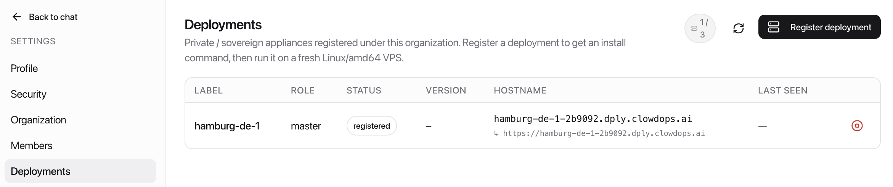
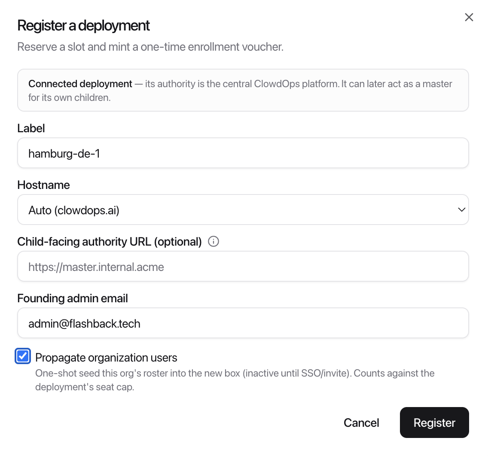
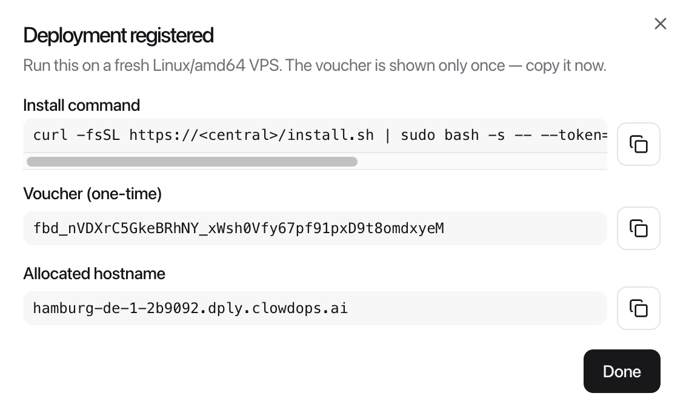

# Register a Deployment

**Audience: org admin.** Registering reserves a slot for your new box and mints the one-time voucher its installer needs. You do this in the ClowdOps portal *before* anyone touches the server.

## Open the Deployments page

Log in to the portal as an **organisation admin** and go to **Settings → Deployments**.



The page lists every deployment your organisation runs, each with a live **status** and **last seen** time, and a quota pill (e.g. `1 / 3`) showing how many of your allowed slots are in use. If you're at your cap, decommission one first or ask your ClowdOps contact to raise the limit.

If your organisation has been granted **flat-use capacity** (see [License type](#license-type) below), a second pill shows it in vCPUs — e.g. `4 / 12 vCPU` — how much of your flat pool is reserved by flat deployments.

## Register

Click **Register deployment** to open the dialog.



Fill in:

| Field | What to enter |
| --- | --- |
| **Label** | A short name for the box, e.g. `paris-dc1`. Used in the auto hostname and throughout the portal. |
| **Hostname** | **Auto (clowdops.ai)** — Central provisions `<label>.dply.clowdops.ai` and its TLS certificate for you. **Bring my own** — you supply a hostname you've pointed at the box (see [Prerequisites → DNS](prerequisites.md#dns)). |
| **Child-facing authority URL** *(optional)* | Only if this box will itself be a **master** for internal children. Enter the internal URL its children will dial, e.g. `https://master.internal.acme`. Leave blank for a standalone deployment. See [Master & children](federation-master-and-children.md). |
| **License type** | **Standard** (the default) — usage is metered and billed per your agreement. **Flat use** — usage is never billed; instead the deployment reserves vCPUs from your organisation's flat capacity pool. The option is greyed out until ClowdOps grants your organisation flat capacity — ask your contact. Fixed once registered. See [License type](#license-type) below. |
| **vCPU budget** *(flat only)* | How many vCPUs this deployment's tree (the box itself plus any children it licenses) may occupy, drawn from your flat pool. The dialog shows how much of the pool is still available. |
| **Products** | Which products this deployment carries (e.g. ClowdInfra, ClowdBI), limited to what your organisation is entitled to. All are pre-selected; deselect to restrict this box. Editable later from the row's **Edit** action. |
| **Founding admin email** | The email that becomes the first platform admin on the new box. Defaults to yours. |
| **Propagate organisation users** | Optional. One-shot copies your org's user roster into the new box (names, emails, roles only — never passwords or keys). Copied users are inactive until they sign in via SSO or are invited. Each one consumes a seat on the new deployment. Leave off unless you specifically want it. |

Click **Register**.

## License type

A **standard** deployment reports its usage and is billed per your commercial agreement. A **flat-use** deployment pays no usage at all — instead its *capacity* is licensed: the box's actual size (its vCPU count, as the hardware reports it) is verified when the installer runs and continuously afterwards, and must fit inside the vCPU budget you set here.

Things to know before choosing **Flat use**:

- The install is **refused with a clear message if the box is bigger than the budget** — resize the box (or raise the budget from the row's **Edit** action) and re-run the same install command; the voucher survives the refusal.
- A flat **master's children draw from the same budget**: a 12-vCPU budget can hold, say, one 4-vCPU master and two 4-vCPU children. Children inherit the flat licence automatically.
- Growing a box later is fine **while the budget has headroom** — the licence adjusts itself within minutes. Outgrowing the budget shows a warning on the deployment row and in the app; resize down or raise the budget to clear it.
- Usage is still *visible* (your Deployments page shows per-box totals) — it just never bills.

## Copy the install command

The dialog now shows everything the sysadmin needs:



| What | Notes |
| --- | --- |
| **Install command** | A one-liner to run on the box as root. It embeds the voucher and points at the correct authority. **Copy this exact command** — don't retype it. |
| **Voucher (one-time)** | The enrolment secret, shown **once**. It's already inside the install command; copy it separately only if you need it for a manual install. |
| **Allocated hostname** | The box's address (auto mode only). |

The install command looks like this:

```bash
curl -fsSL https://platform.clowdops.ai/install.sh | sudo bash -s -- --token=<voucher>
```

> [!IMPORTANT]
> The voucher is shown only once and expires in **72 hours**. Copy the install command now and hand it to whoever provisions the box. If it expires or gets lost, just register again — the slot isn't consumed until a box actually enrols.

Hand the command to your sysadmin and continue at [Install the appliance](install-the-appliance.md).

## After the box comes up

Back on the Deployments page, watch the new row move through its lifecycle:

`registered` → `enrolled` → `active`

Once it's **active**, the founding-admin account is ready to claim — see [Install the appliance → Claim the founding admin](install-the-appliance.md#claim-the-founding-admin). If a row sticks at `enrolled` or never appears, see [Operations → Troubleshooting](operations.md#troubleshooting).
