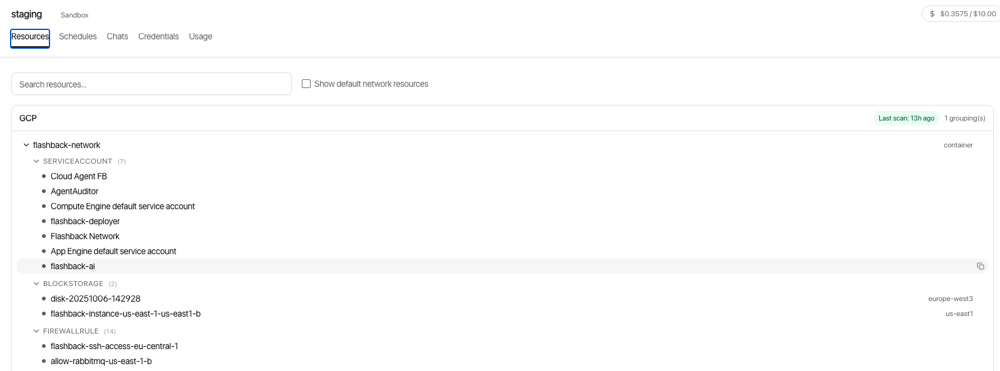
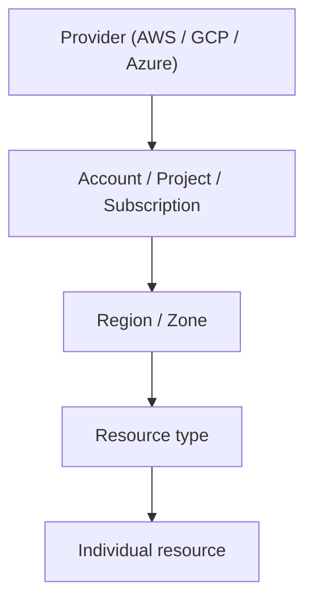

[← ClowdOps](README.md) · [← Chats](chats.md) · [Guardrails & cost caps →](guardrails.md)

# Cloud Resources

**On this page:** [Resource tree](#resource-tree) · [Scan status per credential](#scan-status-per-credential) · [Searching](#searching) · [Inspecting a resource](#inspecting-a-resource) · [Dependency graph](#dependency-graph) · [Show default network resources](#show-default-network-resources)

The **Resources** tab gives you a live inventory of the cloud resources the agent has discovered in your sandbox. It is read-only from the UI — the agent populates it automatically as it explores your infrastructure, and you can trigger targeted re-scans per credential.



## Resource tree

Resources are organised in a hierarchy:

```text
Provider (AWS / GCP / Azure)
└── Account / Project / Subscription
    └── Region / Zone
        └── Resource type
            └── Individual resource
```



Expand any node to drill down. Active resources are shown with a solid indicator; inactive or unknown ones are dimmed. Hover a resource row to reveal a **Copy name** button — handy for pasting an exact resource name or ID back into a chat prompt.

## Scan status per credential

Each credential header in the tree carries a small status pill so you always know whether discovery is fresh:

| Pill | Meaning |
| --- | --- |
| **Scanning… *Ns*** | A discovery scan is running right now; the elapsed counter ticks live |
| **Last run *T* ago · *N* removed** | The last scan finished `T` ago and reconciled `N` resources that no longer exist |
| (no pill) | No scan has run for this credential yet |

The pill polls every 15 seconds. If you expect to see a resource that's not listed, you can trigger a re-scan from the credential's row, or run a discovery-oriented prompt in chat (for example *"Discover all resources in my AWS us-east-1 account"*).

## Searching

Use the search box at the top of the Resources tab to filter the tree by resource name, ID, or type. Search results highlight matching nodes while collapsing unrelated branches.

## Inspecting a resource

Click any resource in the tree to open the detail panel on the right. It shows:

- **Metadata** — raw JSON properties as returned by the cloud provider
- **Dependencies** — inbound (what depends on this resource) and outbound (what this resource depends on)

Use the **Pivot** button on any dependency to jump directly to that resource's detail view.

## Dependency graph

<!-- Screenshot:  -->

The dependency graph visualises the relationships around a selected resource — useful for understanding blast radius before making changes or for troubleshooting connectivity issues.

## Show default network resources

Toggle **Show default network resources** at the top of the panel to include or exclude automatically-created provider resources (default VPCs, default subnets, and so on). These are hidden by default to reduce noise.

> [!NOTE]
> The resource inventory grows over time as the agent runs more queries. The scan-status pills above each credential tell you when each part of the tree was last refreshed.
