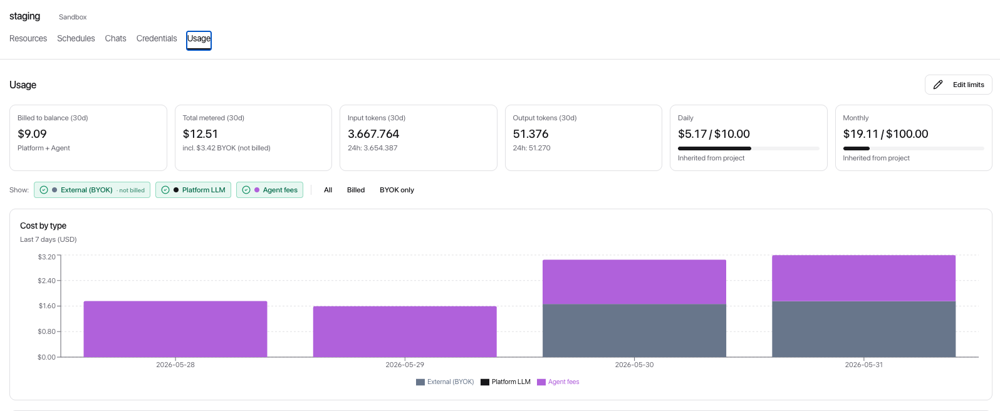

[← ClowdOps](README.md) · [← Guardrails & cost caps](guardrails.md)

# Team & Settings

**On this page:** [Profile](#profile) · [Security](#security) · [Organisation](#organisation) · [Members](#members) · [Plan](#plan) · [Billing](#billing) · [Usage](#usage) · [Activity](#activity)

Access organisation-wide settings and your account via the **Settings** icon at the bottom of the left sidebar.

## Profile

Update your display name, email address, and avatar under **Profile**.

## Security

Manage multi-factor authentication under **Security**:

- Enrol a TOTP authenticator app or a passkey (WebAuthn)
- Activate magic-link login as an alternative method
- Review or revoke trusted devices

## Organisation

Update your organisation's display name and website under **Organisation**. These fields are visible to all members and appear on invoices.

## Members

Invite colleagues and manage roles under **Members**.

### Inviting a member

1. Click **Invite member**.
2. Enter their email address.
3. Select a role.
4. Click **Send invite**.

The invitee receives an email with a join link. They must create an account (or log in if they already have one) before the invitation is accepted.

### Roles

| Role | Access level |
| --- | --- |
| **Admin** | Full access: manage members, billing, all projects and sandboxes |
| **Member** | Access to projects and sandboxes they are invited to |

Update or remove a member at any time from the Members list.

## Plan

The **Plans & credits** page is a storefront: it shows the subscription tiers, your current plan, and credit packs you can buy. Upgrade, downgrade, or cancel from here.

### Subscription tiers

Every organisation always has an active plan. New orgs start on the **Free** tier automatically; from there you can move up the ladder. Each paid tier grants a pool of credit at the start of every billing cycle (more than you pay for — the surplus is the credit "premium") and carries its own 24-hour spend cap.

| Plan | Monthly | Yearly | Credit premium | Daily cap |
| --- | --- | --- | --- | --- |
| **Free** | — | — | Starter grant on signup | Conservative starter cap |
| **Basic** | $20 → $22 credit | $200 → $220 credit | +10% | $2 / day |
| **Pro** | $100 → $120 credit | $1000 → $1200 credit | +20% | $10 / day |
| **Pro+** | $200 → $260 credit | $2000 → $2600 credit | +30% | $20 / day |
| **Enterprise** | $500 → $700 credit | $5000 → $7000 credit | +40% | $50 / day |

- **Credit** lands in your **subscription bucket** at the start of each cycle and is reset (not carried over) on renewal — see [Billing](#billing).
- **Daily cap** is the rolling 24-hour spend brake for the tier; turns are refused with `daily_cap_reached` once it is hit until older spend ages out.
- Choose **monthly** or **yearly** billing per tier; the yearly price is ten months for twelve.

Picking a higher tier mid-cycle upgrades you immediately; the new cycle's grant and cap apply from the change.

## Billing

The **Billing** page is your account view: your current subscription status (with upgrade / cancel), your credit balances, and recent transactions. The storefront for *buying* plans and credit packs lives on the [Plans & credits](#plan) page.

<!-- Screenshot:  -->

### Two credit buckets

ClowdOps tracks credits in two separate buckets. **1 credit = $0.01 USD.** Both buckets are drained automatically as the agent works; the subscription bucket is consumed first.

| Bucket | Source | Expiry |
| --- | --- | --- |
| **PAYG balance** | Credit packs you bought, or custom-amount top-ups | Never expires |
| **Subscription** | Granted at the start of each subscription cycle | **Forfeited on renewal** — unused credits are reset, not carried over |

Three stat cards at the top of the page show:

- **Available** — the total spend headroom (PAYG + active subscription).
- **PAYG balance** — credit packs, never expires.
- **Subscription** — this cycle's grant, with an "expires in *N* days" countdown.

### Buy credits

On the **Plans & credits** page you can top up your PAYG balance two ways:

**Credit packs** — fixed-size packs, some of which include bonus credit:

| Pack | Price | You receive |
| --- | --- | --- |
| **Small** | $10 | $10 credit |
| **Medium** | $50 | $55 credit (+10% bonus) |

**Custom top-up** — when custom-amount purchases are enabled for your org, an **Other amount** option lets you buy any amount between the configured bounds (for example $5 minimum, $1000 maximum), with one-click preset chips ($5, $10, $25, $50, $100).

Either way you pay through **Stripe Checkout**; the grant lands in your **PAYG bucket** and never expires.

### Transactions

The transactions list shows the latest 25 credit movements with friendly labels:

| Label | What it represents |
| --- | --- |
| **Platform LLM** | LLM-token spend when the sandbox uses platform-provided AI keys (billed to your balance, with the platform surcharge applied) |
| **BYOK LLM (metered)** | The small metered usage fee on LLM calls made with your own keys (the token cost itself is on your AI provider's bill) |
| **Agent** | The agent service markup applied on top of LLM spend |
| **Sandbox compute** | Wall-clock seconds the agent's sandbox stayed warm |
| **Credit pack** | A PAYG top-up you purchased |
| **Subscription (initial)** | First grant when you signed up for a plan |
| **Subscription (renewal)** | Cycle renewal grant (the bucket resets to this value) |
| **Referral credit** | A one-time reward from the [Referrals](referrals.md) program |
| **Manual adjustment** | An operator-applied credit or debit |

> [!NOTE]
> Agent spend is split three ways — **BYOK** LLM (your-key metered fee), **platform** LLM (platform-key cost × surcharge), and the **agent** markup. Whichever apply, all of them count toward your budget caps. The [Usage](#usage) dashboard lets you break spend down by these types.

### The 24-hour spend cap

Subscription plans include a **24-hour rolling spend cap** as a safety brake. If the total debit across the last 24 hours hits this cap, new chat turns are refused with `daily_cap_reached` until older debits age out of the window. The cap is shown on the Plan page.

## Usage

The **Usage** page is a real-time dashboard of agent spend.

The same dashboard appears at four scopes; the breadth of data narrows accordingly:

| Where | Scope |
| --- | --- |
| Settings → Usage | Whole organisation |
| Project → Usage | One project (all its sandboxes) |
| Sandbox → Usage | One sandbox (all its chats) |
| (per-chat view) | A single chat session |

Each scope shows:

- **KPI strip** — cost / input tokens / output tokens / daily cap headroom.
- **Cost by day** — stacked bar chart segmented by model, for the last 7 days.
- **Cost by type** — a breakdown of spend across the three cost buckets (**BYOK** LLM, **platform** LLM, and the **agent** markup), with filter chips (*All* · *Billed* · *BYOK*) to focus the charts on one bucket.
- **Token throughput** — daily input/output token totals.
- **Per-model breakdown** — table sorted by cost.

### Editing budgets

If your role allows it, a pencil icon next to the cost KPI opens the budget editor. You can set:

- **Daily** USD cap
- **Monthly** USD cap
- **Per-chat-session** USD cap
- The **allowed action categories** for this scope ([Guardrails & cost caps](guardrails.md))
- **Max consecutive failures** before [scheduled runs](schedules.md) auto-disable

Children scopes inherit from parents. The editor surfaces the parent's value as a hint and clamps inputs above the parent cap. See [Guardrails & cost caps](guardrails.md) for the full inheritance model and the permissions required to edit each scope.

## Activity

The **Activity** log shows an event history for your organisation: logins, configuration changes, member invites, credential updates, and more. Use it for audit or compliance purposes.
