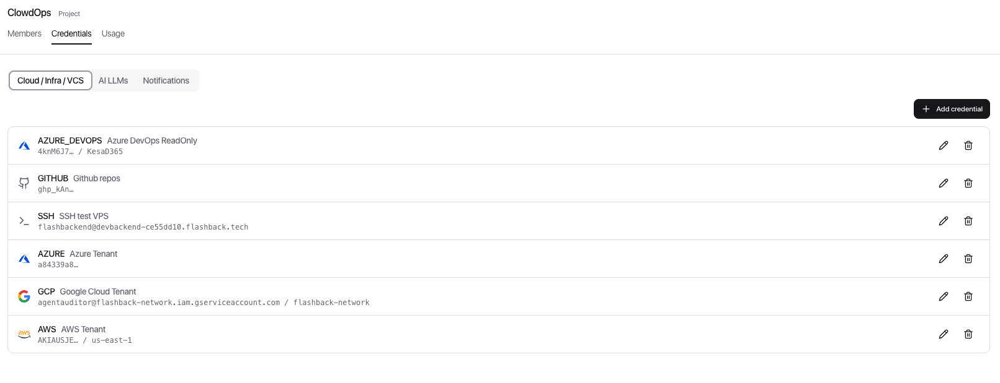
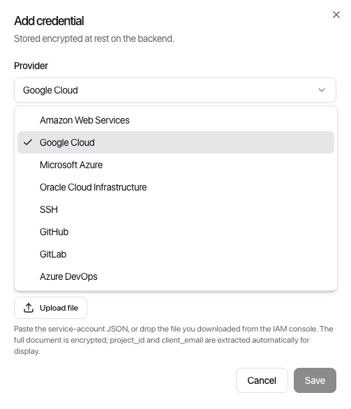
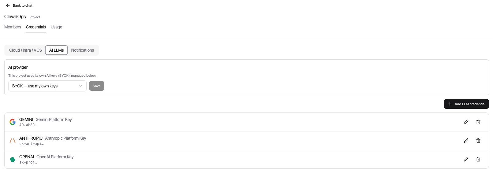
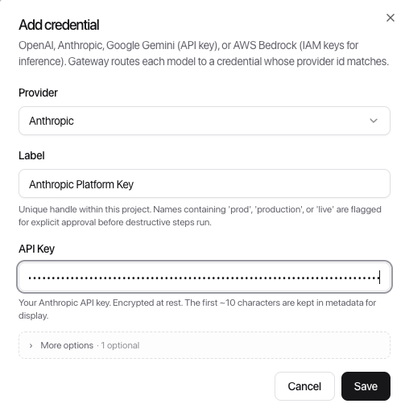

[← ClowdOps](README.md) · [← Getting Started](getting-started.md) · [Chat →](chat.md)

# Projects, Sandboxes & Credentials

**On this page:** [Projects and sandboxes](#projects-and-sandboxes) · [The project tabs](#the-project-tabs) · [Credentials](#credentials) · [How your keys stay private at rest](#how-your-keys-stay-private-at-rest) · [Cloud credentials](#cloud-credentials) · [AI credentials](#ai-credentials) · [Notification channels](#notification-channels) · [Seeing what your credentials reach](#seeing-what-your-credentials-reach)

## Projects and sandboxes

**Projects** are team-level groupings. Every sandbox belongs to a project. Use projects to separate concerns — for example, one project per team or per application domain.

**Sandboxes** are the execution scope. All agent runs, templates, schedules, and credentials are tied to a sandbox. A common pattern is one sandbox per cloud account or per environment (dev / staging / prod).

Switch between projects and sandboxes at any time using the dropdowns at the top of the left sidebar. The agent always operates within the currently selected sandbox.

> [!TIP]
> To rename a project or sandbox, hover its name in the page header and click the pencil. Edit inline and press **Enter** to save (or **Escape** to cancel).

## The project tabs

Opening a project gives you a tabbed view of everything scoped to it:

| Tab | What it holds |
| --- | --- |
| **Members** | Who has access to this project, and at what level |
| **Credentials** | The cloud, VCS, SSH, AI and notification credentials described below |
| **Usage** | Spend for this project and everything under it, plus the [budget editor](guardrails.md#where-to-configure) |
| **Artifacts** | The project's [documents](artifacts.md) — digests, briefs and reports the agent drafts and your team approves |

A **budget pill** in the header shows today's spend against the effective daily cap; click it to jump to Usage.

> [!NOTE]
> ClowdBI uses the same shell for its [data projects](../bi-agent/data-projects.md), with its own tab set. If you work in both products, the navigation is the same shape in each.

---

## Credentials

Credentials connect the agent to your cloud providers and AI APIs. They are stored encrypted and never exposed in plaintext after creation.

Open the **Credentials** tab inside any sandbox to manage them.

### How your keys stay private at rest

ClowdOps never stores your credentials in a form that can be read directly. Each key is protected at rest so that accessing the database alone is not sufficient to recover it — the material needed to use a credential is kept separate from the credential itself, and is only made available to the agent at the moment it needs to make a call on your behalf. Nothing sensitive is held any longer than necessary.

### Cloud credentials

Cloud credentials grant the agent access to your infrastructure. Supported providers:

| Provider | Type | Required fields |
| --- | --- | --- |
| **AWS** | Cloud | Access Key ID, Secret Access Key, Region |
| **GCP** | Cloud | Service Account JSON key |
| **Azure** | Cloud | Tenant ID, Client ID, Client Secret, Subscription ID |
| **OCI** | Cloud | Tenancy OCID, User OCID, Key Fingerprint, API Private Key (PEM), Region (optional) |
| **SSH** | Compute / VMs | Host, Username, Private key |
| **GitHub** | VCS | Personal access token or App credentials |
| **GitLab** | VCS | Personal access token, Host URL |
| **Azure DevOps** | VCS | Organisation URL, Personal access token |

To add a cloud credential:

1. Click **Add credential** in the Cloud tab.
2. Select a provider (AWS, GCP, Azure, GitHub, and so on).
3. Fill in the required fields (for example Access Key ID + Secret for AWS).
4. Save. The credential appears in the list with a safe display hint (for example `AKIA1234 / us-east-1`).

Credentials you create at the project level are reusable across sandboxes. From the Credentials tab you can **associate** existing credentials with the current sandbox or **dissociate** ones no longer needed.

### AI credentials

Every sandbox needs access to an AI model to function. There are two ways to provide it, configured per project in the **AI** tab of Project → Credentials. The two modes are mutually exclusive.

#### BYOK — bring your own key

Add your own API key for OpenAI, Anthropic, Google Gemini, or AWS Bedrock in the project AI tab. Associate it with a sandbox and the agent uses it for all LLM calls in that sandbox.

- **You pay your AI provider directly** for token usage. This cost does not appear in your ClowdOps billing history.
- **ClowdOps bills** sandbox compute time and a small metered usage fee, shown as *BYOK LLM (metered)* and *Sandbox compute* in Settings → Billing.
- The **model resolver** selects the active provider from a priority list (OpenAI → Anthropic → Gemini → Bedrock by default), intersected with which providers are actually attached to the sandbox. The picked model appears in the chat header badge (for example `$0.04 / $5.00 · claude-sonnet-4`).

> [!IMPORTANT]
> A sandbox with no AI credential attached has its chat composer disabled — the agent cannot run until at least one is associated.

To change which model the agent uses, add or remove AI credentials so the priority list resolves to a different provider.

#### Platform-provided AI

At the top of the AI tab on the Project → Credentials page, an **AI provider** selector lets you choose OpenAI, Anthropic, Gemini, or Bedrock and use Flashback's own keys — no credential to create or rotate.

- **LLM cost is billed to your organisation's credit balance**, alongside sandbox compute. Both appear in Settings → Billing as *Platform LLM* and *Sandbox compute*.
- When a platform provider is selected, the **Add AI credential** button in the AI tab is disabled. The two modes cannot be active at the same time.
- To switch **from platform to BYOK**: change the selector to *BYOK — use my own keys* and add an AI credential below.
- To switch **from BYOK to platform**: remove every AI credential from the project first, then select a provider. The selector is replaced by an informational note while any BYOK key is present.

#### Cost at a glance

| Mode | LLM cost | Compute cost |
| --- | --- | --- |
| **BYOK** | On your AI provider's bill | On your ClowdOps balance (*BYOK LLM (metered)* + *Sandbox compute*) |
| **Platform** | On your ClowdOps balance (*Platform LLM*) | On your ClowdOps balance (*Sandbox compute*) |

### Notification channels

Notification channels let the agent push messages to where your team already is — Slack, Microsoft Teams, PagerDuty, Telegram, or email (SMTP). They appear in the **Notifications** tab of the Credentials section.

| Provider | Required fields |
| --- | --- |
| **Slack** | Incoming webhook URL |
| **Microsoft Teams** | Incoming webhook URL |
| **PagerDuty** | Routing key (Events API v2) |
| **Telegram** | Bot token (from @BotFather) + chat ID |
| **SMTP** | Host, port, username, password, sender address, recipient address(es) |

> [!TIP]
> **Telegram is two-way.** Besides receiving the agent's messages, a Telegram chat can also *drive* the sandbox's agent — you message the bot and it plans and executes, with guarded actions confirmed by an Allow/Deny tap. See [Telegram](tg.md).

The process is the same as for other credentials: click **Add notification channel** in the Notifications tab, select the provider, fill in the fields, and save.

> [!IMPORTANT]
> ClowdOps holds notification credentials and makes the outbound request on your behalf — the secret is never handed to the agent or exposed anywhere in the conversation.

For a step-by-step setup guide for each provider (including CLI examples), see [Credential Setup Recipes](credentials/README.md).

Once a channel is attached to a sandbox, the agent can use it in two ways:
- **Ad-hoc during chat** — ask the agent to *"post this finding to Slack"* and it will call the `notify` tool (see [Sending notifications from chat](chat.md#notifications)).
- **Automatic schedule digests** — configure a channel on a schedule and the platform posts a summary after each run (see [Post-run digest](schedules.md#step-6-post-run-digest)).

## Seeing what your credentials reach

A credential is a secret you configured. The **system it reaches** — a cloud account, a Slack workspace, an SMTP host — is what actually breaks, and several credentials often point at the same one.

**Settings → Connections** lists those systems for the selected project, with the health the platform has observed for each: *healthy*, *expiring*, *degraded*, *broken*, *unknown*, or *disabled*.

Health is derived from real deliveries and real token refreshes, never from a synthetic poll — so a credential nothing has used recently stays *unknown* rather than being called healthy on the strength of a ping, and a credential that broke is usually flagged before anybody notices.

> [!TIP]
> When queries or notifications start failing, check Connections before re-entering credentials. It will usually tell you *which* external system is rejecting you and why — which is a shorter path than re-creating a credential that was never the problem.

Full page: **[Connections](../common/connections.md)**.
